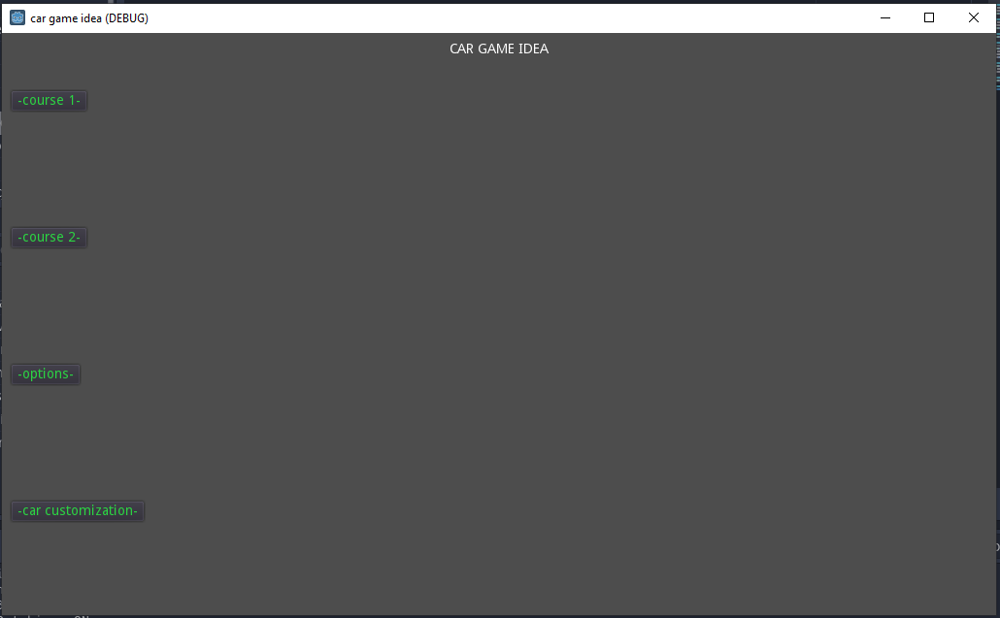
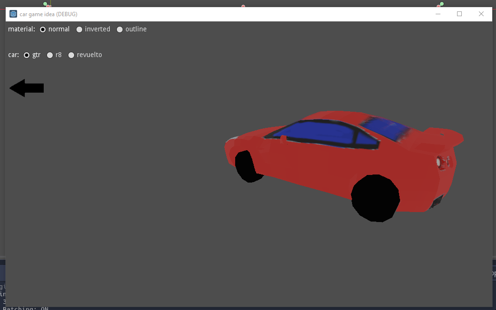
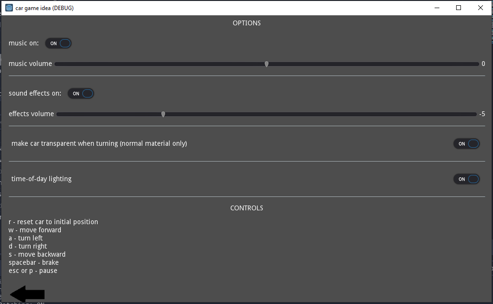
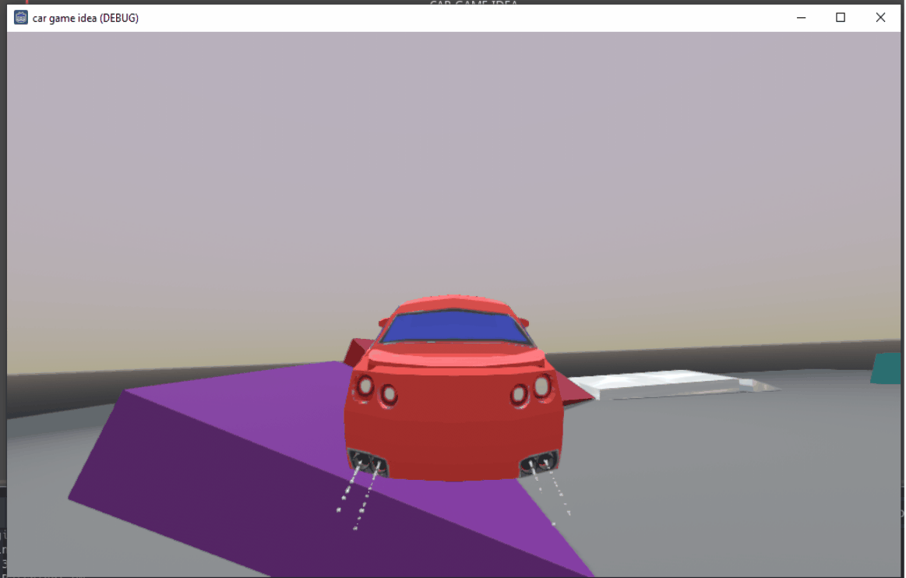

# car_game_idea    
    
a car game idea made with Godot 3! not much to see here atm :)    
    
some screenshots:    
    
    
    
    
    
    
    
    
    
some concepts I explore in this demo:    
- using/writing shaders in Godot
- changing playable car model + customizations (e.g. different car model textures)
- time-dependent lighting
- particle generation (e.g. exhaust smoke)
- switching scenes + managing game state
- UI creation (it's hard :/)
- creating a racetrack within Godot using Path and CSGPolygon nodes (much thanks to  on how to do so)